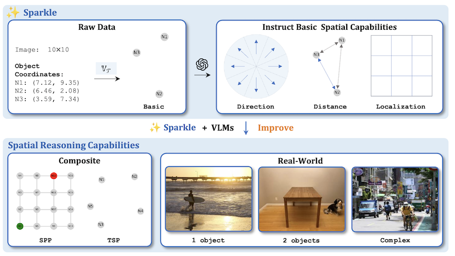

#  Sparkle

[[Paper]](https://arxiv.org/abs/2410.16162)

Code for our paper "Sparkle: Mastering Basic Spatial Capabilities in Vision Language Models Elicits Generalization to Spatial Reasoning" 

Published at **EMNLP 2025** as Findings

Received [**Best Paper Award**](https://raw.githubusercontent.com/YihongT/Sparkle/refs/heads/main/imgs/mklm.png) at **IJCAI MKLM Workshop 2025**


**Code will be released soon. Stay tuned!**


## ⭐️ Highlights

* We present Sparkle (SPAtial Reasoing through Key capabiLities Enhancement), a framework to enhance **2D spatial reasoning** ability of **vision language models**
* Sparkle disentangles spatial reasoning into three **basic capabilities**: **direction** comprehension, **distance** estimationlocalization, and **localization**
* By synthesizing training data for these three capabilities, VLMs show improvement on composite and out-of-distribution real-world spatial reasoning tasks


## 📌 Abstract

Vision language models (VLMs) perform well on many tasks but often fail at spatial reasoning, which is essential for navigation and interaction with physical environments. Many spatial reasoning tasks depend on fundamental two-dimensional (2D) skills, yet our evaluation shows that state-of-the-art VLMs give implausible or incorrect answers to composite spatial problems, including simple pathfinding tasks that humans solve effortlessly. To address this, we enhance 2D spatial reasoning in VLMs by training them only on basic spatial capabilities. We first disentangle 2D spatial reasoning into three core components: direction comprehension, distance estimation, and localization. We hypothesize that mastering these skills substantially improves performance on complex spatial tasks that require advanced reasoning and combinatorial problem solving, while also generalizing to real-world scenarios. To test this, we introduce Sparkle, a framework that generates synthetic data to provide targeted supervision across these three capabilities and yields an instruction dataset for each. Experiments show that VLMs fine-tuned with \emph{Sparkle} improve not only on basic tasks but also on composite and out-of-distribution real-world spatial reasoning tasks. These results indicate that enhancing basic spatial skills through synthetic generalization effectively advances complex spatial reasoning and offers a systematic strategy for boosting the spatial understanding of VLMs.

<p align="center">
 
</p>


## 🛠️ Usage

TBD


## 📃 License

This project is released under the [license](LICENSE).


## 🖊️ Citation

If you find this work helpful for your research, please consider giving this repo a star ⭐ and citing our paper:

```bibtex
@article{tang2024sparkle,
  title={Sparkle: Mastering Basic Spatial Capabilities in Vision Language Models Elicits Generalization to Spatial Reasoning},
  author={Tang, Yihong and Qu, Ao and Wang, Zhaokai and Zhuang, Dingyi and Wu, Zhaofeng and Ma, Wei and Wang, Shenhao and Zheng, Yunhan and Zhao, Zhan and Zhao, Jinhua},
  journal={arXiv preprint arXiv:2410.16162},
  year={2024}
}
```


